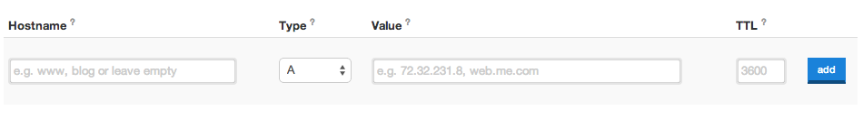

# 도메인

PythonAnywhere에서는 기본 도메인을 제공하고 있습니다. 하지만 블로그 주소 끝에 ".pythonanywhere.com"을 지우고 싶은 분이 있겠죠. 블로그에 "www.infinite-kitten-pictures.org", "www.3d-printed-stream-engine-parts.com", "www.antique-buttons.com" 또는 "www.mutant-unicornz.net" 과 같은 도메인을 지정하고 싶을지도 모르겠네요.

이제 도메인을 어떻게 등록하고, PythonAnywhere에 설정하는지 알아봅시다. 하지만 대부분 도메인에는 유지비용이 들고, PythonAnywhere 에서 고유 도메인을 사용하기 위해서 월 비용을 지급해야 합니다. 금액이 매우 비싸지는 않지만 도메인이 정말 필요할 때 구매하세요.

## 도메인을 어디에서 등록하나요?

보통 도메인에는 15달러/년의 비용이 듭니다. 도메인 구입처에 따라 옵션에 따라 더 싸질 수도 비싸질 수도 있습니다. 도메인 판매회사가 많이 있습니다. 단순히 [구글 검색](https://www.google.com/search?q=register%20domain) 만 해봐도 수천 개의 판매처를 확인할 수 있습니다.

추천 드리는 곳은 [iwantmyname.com](https://iwantmyname.com/) 입니다. 이 곳의 장점은 "고통스럽지 않은 도메인 관리기능" 입니다. 정말 고통스럽지 않아요.

무료로 도메인을 구할 수도 있습니다. [dot.tk](http://www.dot.tk) 에서도 무료 도메인을 구할 수 있습니다. 하지만 무료 도메인 사용에 주의를 기울일 필요가 있습니다. (역자 주: 도메인명 제한, 연장 횟수 제한) 전문 비즈니스 사이트를 운영하고 있다면, `.com` 으로 끝나는 "적법한" 유료 도메인 사용을 고려해야 합니다..

## PythonAnywhere에 도메인 연결하기

*iwantmyname.com* 에서 도메인을 등록했다면, 메뉴에서 `도메인(Domains)` 을 클릭하시고 새로 구입한 도메인을 선택하세요. 그 다음 `DNS 레코드 관리(manage DNS records)` 를 클릭하세요.

이제 이 화면으로 가세요:

그리고 아래와 같이 세부 내용들을 입력해주세요. : - Hostname: www - Type: CNAME - Value: PythonAnywhere에서 쓰고있던 도메인 (예를 들어 djangogirls.pythonanywhere.com 같이 이전 튜토리얼에서 사용했던 주소) - TTL: 60

추가(Add) 버튼을 누른 후 하단에 변경사항 저장(Save changes) 버튼을 누릅니다.

> **Note** 다른 도메인 제공업체를 이용한다면, DNS / CNAME 설정 화면(UI)이 다를 수 있습니다. 하지만 기본적인 사항은 같으니 걱정하지 마세요. CNAME을 설정해 새 도메인이 `yourusername.pythonanywhere.com`으로 연결하면 됩니다..

설정한 도메인 설정이 반영되는데 몇 분 정도 걸릴 수 있으니 인내심을 가지세요!

## PythonAnywhere 웹 앱에 도메인 설정하기

사용자 지정 도메인을 사용하려면 PythonAnywhere에게 그 도메인을 사용하겠다고 알려줘야 해요.

[PythonAnywhere 계정 페이지(Accounts page)](https://www.pythonanywhere.com/account/) 로 가서 여러분의 계정을 업그레이드 하세요. 가장 저렴한 옵션(일명 "해커" 플랜)이 시작하기에 좋겠군요. 여러분이 끝내주게 유명해져서 수백만 접속이 일어날 때가 오면 그때 더 상위 플랜으로 올리도록 해요.

다음, [웹 탭(Web tab)](https://www.pythonanywhere.com/web_app_setup/) 으로 가서 2가지를 적어놓으세요. :

  * **virtualenv 경로**를 복사해 다른 곳에 잠시 복사해 놓으세요.
  * **wsgi 설정 파일(config file)** 을 클릭해 내용을 복사하고, 다른 곳에 잠시 붙여넣고 보관해 놓으세요.

다음, 이전 웹 앱 설정을 **삭제** 하세요. 걱정하지 마세요. 여기서 삭제하는 건 소스가 아니라 설정을 삭제하는 것이에요.*yourusername.pythonanywhere.com* 처럼 이전 도메인으로 연결된 도메인을 새로운 도메인으로 변경하려고 삭제하는 거에요. 이제 새 웹 앱을 만들고 다음 단계를 따라하세요. :

  * 새 도메인 이름을 입력하세요.
  * "수동 설정(manual configuration)"을 선택하세요.
  * Python 3.4 를 선택하세요.
  * 그리고.. 오, 이제 다 되었네요!

이제 웹 탭(web tab) 으로 다시 돌아오세요.

  * 아까 안전한 곳에 복사해 두었던 virtualenv 경로를 붙여넣으세요.
  * Wsgi 설정 파일(configuration file) 을 클릭해서 역시 아까 설정한 내용을 붙여넣으세요.

웹 앱을 다시 불러오기를 한 후, 새 도메인으로 접속했을 때 여러분의 사이트가 보이는지 확인하세요!

만약 문제가 있다면 PythonAnywhere 사이트에 있는 "피드백 보내기(Send feedback)"에서 물어보세요. PythonAnywhere의 관리자가 친절하게 도움을 줄 거에요.