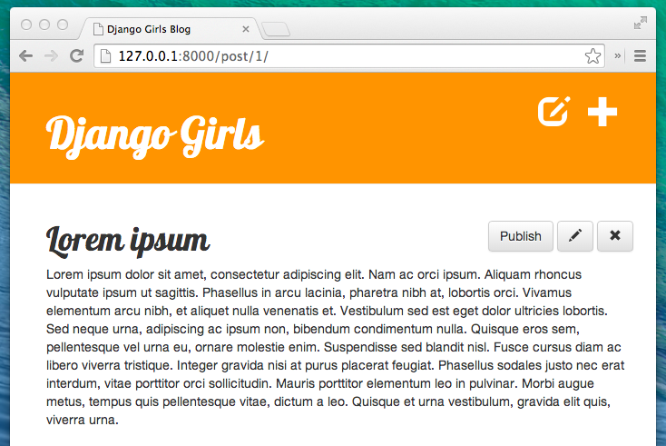

# 숙제: 웹사이트에 하나 더 추가하기!

튜토리얼의 마지막이군요. 이미 많은 것을 배웠어요! 이제 배운 것을 써볼 시간입니다.

## 미 게시된 포스트 목록 페이지 만들기

기본 튜토리얼에서 배웠던 QuerySet 내용 모두 기억하고 있죠? 기본 튜토리얼에서는 블로그 포스팅만 보여주는 `post_list`을 만들었어요.).

이번에도 비슷한 것을 해볼 건데요. 하지만 이번에는 임시저장(draft) 기능을 구현해볼 거에요.

새로운 포스팅 추가하기 버튼 근처에 blog/templates/blog/base.html 링크를 추가하세요. (`<h1><a href="/">Django Girls Blog</a></h1>` 위에 바로 추가하면 됩니다!) :

```django
<a href="" class="top-menu"><span class="glyphicon glyphicon-edit"></span></a>
```

다음: url입니다! `Blog/urls.py`을 열고 아래 내용을 추가할 거에요. :

```python
url(r'^drafts/$', views.post_draft_list, name='post_draft_list'),
```

`blog/views.py`에 view를 생성할 차례입니다. :

```python
def post_draft_list(request):
    posts = Post.objects.filter(published_date__isnull=True).order_by('created_date')
    return render(request, 'blog/post_draft_list.html', {'posts': posts})
```

`Post.objects.filter(published_date__isnull=True).order_by('created_date')` 코드를 뜯어 살펴봅시다. `filter(published_date__isnull=True)` 코드로 발행되지 않은 포스팅목록을 가져옵니다. `order_by('created_date')` 코드로 created_date 필드에 대해 오름차순 정렬을 수행합니다.).

마지막으로 템플릿을 수정해 봅시다. 아래 내용으로 `blog/templates/blog/post_draft_list.html` 파일을 생성해주세요.

```django



    
        <div class="post">
            <p class="date">created: {{ post.created_date|date:'d-m-Y' }}</p>
            <h1><a href="">{{ post.title }}</a></h1>
            <p>{{ post.text|truncatechars:200 }}</p>
        </div>
    

```

`post_list.html` 템플릿과 코드가 많이 비슷해보이죠?

브라우저로 `http://127.0.0.1:8000/draft/` 페이지를 열어보면, 미 게시된 포스팅목록을 확인할 수 있어요.

야호! 첫 번째 일이 마쳤어요!

## 게시 버튼 추가하기

포스트 상세페이지에 포스트를 바로 게시할 수 있는 버튼을 만들면 좋겠죠?

`blog/template/blog/post_detail.html` 를 열고, 아래 내용을 변경해봅시다. :

```django

    {{ post.published_date }}

```

에서 아래와 같이 변경합니다.

```django

    {{ post.published_date }}

    <a class="btn btn-default" href="">Publish</a>

```

보시는 대로 `` 템플릿 태그를 추가했습니다. 이는 `` 조건이 만족하지 않을 때 (`published_date` 필드가 비어있을 때), `<a class="btn btn-default" href="">Publish</a>` 내용으로 렌더링됩니다. `` 템플릿태그에 `pk` 인자를 넘겨줌에 유의하세요..

`blog/urls.py` 에 URL 패턴을 추가해봅시다.

```python
url(r'^post/(?P<pk>[0-9]+)/publish/$', views.post_publish, name='post_publish'),
```

마지막으로 post_publish 뷰를 *blog/views.py* 에 추가해봅시다.

```python
def post_publish(request, pk):
    post = get_object_or_404(Post, pk=pk)
    post.publish()
    return redirect('blog.views.post_detail', pk=pk)
```

다음으로 blog/models.py 파일에서 Post 모델에 `publish` 멤버 함수를 추가해주세요.

```python
def publish(self):
    self.published_date = timezone.now()
    self.save()
```

자, 발행기능을 모두 구현했습니다 !

포스팅을 발행하면 그 즉시 `post_detail` 페이지로 리다이렉션됩니다.


축하해요 ! 거의 다 왔습니다. 마지막 단계는 삭제 버튼을 추가하는 것입니다.

## 포스트 삭제하기

`blog/templates/blog/post_detail.html` 파일에 아래 코드를 추가해주세요.

```django
<a class="btn btn-default" href=""><span class="glyphicon glyphicon-remove"></span></a>
```

수정 버튼 바로 아래 줄에 추가해주세요.

`blog/urls.py` 에 URL 패턴을 추가해봅시다.

```python
url(r'^post/(?P<pk>[0-9]+)/remove/$', views.post_remove, name='post_remove'),
```

이제 post_remove 뷰를 구현해봅시다. `blog/views.py` 에 아래 코드를 추가해주세요.

```python
def post_remove(request, pk):
    post = get_object_or_404(Post, pk=pk)
    post.delete()
    return redirect('blog.views.post_list')
```

이제 블로그 포스팅을 삭제할 수 있게 되었어요. Django 모델을 삭제할 때에는 단순히 `.delete()` 멤버 함수를 호출하시면 됩니다.

포스팅을 삭제하고 나면 포스팅목록 화면으로 리다이렉션됩니다. 이 때 `django. shortcuts. redirect` 숏컷 함수를 썼어요..

이제 테스트 해봅시다! 포스트 페이지로 가서 포스트를 삭제해 보세요!



마지막까지 잘 해냈어요! 드디어 튜토리얼을 마쳤답니다! 정말 멋져요!