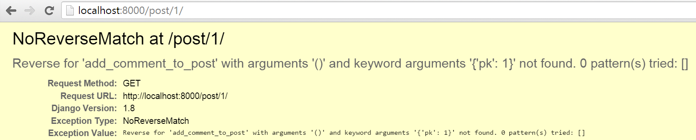

# 숙제 : Comment 모델 만들기

지금까지 우리는 방문자로부터 피드백을 받아서 저장하는 Post 모델에 대해서만 다뤘습니다.

## blog 앱의 Comment 모델 만들기

blog/models.py 파일을 열고, 끝에 아래 내용을 추가해주세요.

```python
class Comment(models.Model):
    post = models.ForeignKey('blog.Post', related_name='comments')
    author = models.CharField(max_length=200)
    text = models.TextField()
    created_date = models.DateTimeField(default=timezone.now)
    approved_comment = models.BooleanField(default=False)

    def approve(self):
        self.approved_comment = True
        self.save()

    def __str__(self):
        return self.text
```

각 필드타입들에 대한 설명은 튜토리얼 **Django Models** 챕터에서 다뤘었어요.

이 챕터에서는 새로운 필드 타입을 써볼게요. - `models.BooleanField` - 참/거짓 필드

`models.ForeignKey` 의 `related_name` 옵션은 Post 모델에서 댓글목록에 접근하기 위한 이름입니다.

## 데이터베이스에 새 모델에 대한 테이블 생성하기

자. 데이터베이스에 Comment 모델을 추가할 시간이예요. 그럴려면 Django 에게 모델의 변경내역을 알 수 있도록 해줘야합니다. `python manage.py makemigrations blog` 명령을 입력하세요.

    (myvenv) ~/djangogirls$ python manage.py makemigrations blog
    Migrations for 'blog':
      0002_comment.py:
        - Create model Comment
    

`blog/migrations` 디렉토리에 새로이 마이그레이션 파일이 생성된 것을 확인하실 수 있어요. 이제 `python manage.py migrate blog` 명령으로 이 변경내역을 적용해야합니다. 다음과 같은 출력이 나와야만 해요.

    (myvenv) ~/djangogirls$ python manage.py migrate blog
    Operations to perform:
      Apply all migrations: blog
    Running migrations:
      Rendering model states... DONE
      Applying blog.0002_comment... OK
    

이제 Comment 모델은 데이터베이스 상에 존재합니다. 관리자 패널에서 Comment 모델에 접근할 수 있다면 멋지겠죠?

## 관리자 패널에 Comment 모델 등록하기

관리자 패널에 모델을 등록할려면, `blog/admin.py` 에 아래 코드를 추가해주세요.

```python
admin.site.register(Comment)
```

Comment 모델을 import 하는 것을 까먹지마세요. 소스파일은 아래와 같은 내용이여야 합니다.

```python
from django.contrib import admin
from .models import Post, Comment

admin.site.register(Post)
admin.site.register(Comment)
```

명령 프롬프트에서 `python manage.py runserver` 명령을 입력하고 [http://127.0.0.1:8000/admin](http://127.0.0.1:8000/admin/) 페이지로 가서, Comment 생성/삭제/목록확인을 해보세요. 망설이지 말고 바로 해보세요.

## Comment 를 노출시켜봅시다.

`blog/templates/blog/post_detail.html` 파일 `` 태그 전에 아래 코드를 추가해주세요.

```django
<hr>

    <div class="comment">
        <div class="date">{{ comment.created_date }}</div>
        <strong>{{ comment.author }}</strong>
        <p>{{ comment.text|linebreaks }}</p>
    </div>

    <p>No comments here yet :(</p>

```

자 이제 post details 페이지에서 댓글들을 확인할 수 있어요.

좀 더 이쁘게 보여지면 좋겠어요. `static/css/blog.css` 에 아래 css 코드를 추가해보세요.

```css
.comment {
    margin: 20px 0px 20px 20px;
}
```

post list 페이지에서 각 post 별 댓글갯수를 노출시켜봅시다. `blog/templates/blog/post_list.html` 에 아래 코드를 추가해주세요.

```django
<a href="">Comments: {{ post.comments.count }}</a>
```

템플릿에 위 코드를 적용하면 아래와 같은 내용이여야 합니다.

```django



    
        <div class="post">
            <div class="date">
                {{ post.published_date }}
            </div>
            <h1><a href="">{{ post.title }}</a></h1>
            <p>{{ post.text|linebreaks }}</p>
            <a href="">Comments: {{ post.comments.count }}</a>
        </div>
    

```

## 방문자가 댓글을 남길 수 있도록 해봅시다

이제 방문자는 댓글을 확인할 수는 있지만 댓글을 남길 수는 없어요. 남길 수 있도록 해봅시다.

`blog/forms.py` 파일 끝에 아래 코드를 추가해보세요.

```python
class CommentForm(forms.ModelForm):

    class Meta:
        model = Comment
        fields = ('author', 'text',)
```

Comment 모델을 import 하는 것을 까먹지 마세요. 다음 코드를

```python
from .models import Post
```

아래와 같이 수정해주세요.

```python
from .models import Post, Comment
```

이제 `blog/templates/blog/post_detail.html` 파일에서 `` 전에 아래 코드를 추가해주세요.

```django
<a class="btn btn-default" href="">Add comment</a>
```

post detail 페이지로 가면, 에러가 뜰 거예요.



이를 고쳐봅시다. `blog/urls.py` 파일 `urlpatterns` 에 아래 패턴을 추가해주세요.

```python
url(r'^post/(?P<pk>[0-9]+)/comment/$', views.add_comment_to_post, name='add_comment_to_post'),
```

이제 또 다른 에러가 뜰 거예요.


이 에러를 잡을려면, `blog/views.py` 에 아래 코드를 추가해주세요.

```python
def add_comment_to_post(request, pk):
    post = get_object_or_404(Post, pk=pk)
    if request.method == "POST":
        form = CommentForm(request.POST)
        if form.is_valid():
            comment = form.save(commit=False)
            comment.post = post
            comment.save()
            return redirect('blog.views.post_detail', pk=post.pk)
    else:
        form = CommentForm()
    return render(request, 'blog/add_comment_to_post.html', {'form': form})
```

소스코드 상단에 PostForm/CommentForm 클래스를 import 하는 것을 까먹지 마세요.

```python
from .forms import PostForm, CommentForm
```

이제 post detail 페이지로 가보시면, "Add Comment" 버튼을 확인할 수 있을 겁니다.


하지만, 이 버튼을 누르면 또 에러가 발생합니다. :(


이 에러는 뷰에서 지정된 템플릿이 없다는 에러입니다. `blog/templates/blog/add_comment_to_post.html` 경로에 아래 코드내용으로 파일을 생성해주세요.

```django



    <h1>New comment</h1>
    <form method="POST" class="post-form">
        {{ form.as_p }}
        <button type="submit" class="save btn btn-default">Send</button>
    </form>

```

Yay! 이제 방문자는 댓글을 남길 수 있게 되었어요. :D

## 댓글 관리하기

현재 블로그에 남겨진 모든 댓글들이 post detail 페이지에 노출되고 있어요. 블로그 관리자에게는 댓글을 승인하거나 삭제하는 기능을 필요합니다. 자.만들어봅시다.

`blog/templates/blog/post_detail.html` 파일은 현재 아래와 같은 내용입니다.

```django

    <div class="comment">
        <div class="date">{{ comment.created_date }}</div>
        <strong>{{ comment.author }}</strong>
        <p>{{ comment.text|linebreaks }}</p>
    </div>

    <p>No comments here yet :(</p>

```

이를 다음과 같이 수정해주세요.

```django

    
    <div class="comment">
        <div class="date">
            {{ comment.created_date }}
            
                <a class="btn btn-default" href=""><span class="glyphicon glyphicon-remove"></span></a>
                <a class="btn btn-default" href=""><span class="glyphicon glyphicon-ok"></span></a>
            
        </div>
        <strong>{{ comment.author }}</strong>
        <p>{{ comment.text|linebreaks }}</p>
    </div>
    

    <p>No comments here yet :(</p>

```

`NoReverseMatch` 예외가 뜰 텐데요. 이를 `comment_remove`, `comment_approve` 패턴에 매칭되는 url 이 없기 때문입니다.

`blog/urls.py` 에 다음 url 패턴을 추가해주세요.

```python
url(r'^comment/(?P<pk>[0-9]+)/approve/$', views.comment_approve, name='comment_approve'),
url(r'^comment/(?P<pk>[0-9]+)/remove/$', views.comment_remove, name='comment_remove'),
```

이제 `AttributeError` 예외가 발생할 겁니다. 이 예외를 해결하기 위해, `blog/views.py` 에 아래 2개의 뷰를 생성해주세요.

```python
@login_required
def comment_approve(request, pk):
    comment = get_object_or_404(Comment, pk=pk)
    comment.approve()
    return redirect('blog.views.post_detail', pk=comment.post.pk)

@login_required
def comment_remove(request, pk):
    comment = get_object_or_404(Comment, pk=pk)
    post_pk = comment.post.pk
    comment.delete()
    return redirect('blog.views.post_detail', pk=post_pk)
```

그리고, 물론 필요한 import 도 꼭 체크해주세요.

모두 잘 동작하는 듯 보이지만, 한 가지 빠뜨린 것이 있습니다. 현재 post list 에서는 등록된 모든 댓글의 갯수가 노출되고 있는 데요. 승인된 댓글의 갯수가 노출되도록 수정해봅시다.

`blog/templates/blog/post_list.html` 파일에서 아래 코드를

```django
<a href="">Comments: {{ post.comments.count }}</a>
```

다음과 같이 수정해주세요.

```django
<a href="">Comments: {{ post.approved_comments.count }}</a>
```

그리고 `blog/models.py` 파일에서 Post 모델에 아래 메소드를 추가해주세요.

```python
def approved_comments(self):
    return self.comments.filter(approved_comment=True)
```

이제 댓글 기능을 모두 만들었습니다. 축하해요. :-)